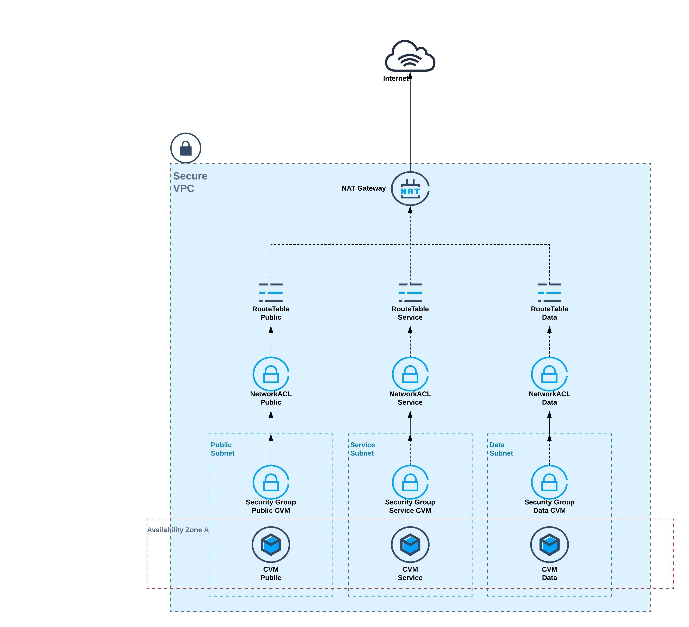

# Cross Industry Solution - SecureVPC - TIC code

This solution is being created to serve any kind of deployment that needs a multi tier secured VPC with best practices applied directly in the architecture and explained below

# Requirements

There are no special requirements to implement this solution as it is one of the basic building blocks of the cloud infrastructure
However, you need some basic requirements:

## Standard Requirements
     - Tencent Cloud Account
     - local terraform: https://learn.hashicorp.com/terraform/getting-started/install.html
     - a code editor: https://code.visualstudio.com/download

# Design

# Components

 ## VPC
    - The VPC is a standard Tencent Cloud network component which creates an isolated network in the Customer account
    - It can be deployed in any region
    - Only 1 CIDR will be associated with it, in our implementation case will be a /16
 ## Subnets
    - The subnet is a logical segregation of the VPC CIDR which can be handled separately
    - The subnet is uniquely mapped to an Availability Zone
    - Route Tables and Network ACL can be associated with the subnet (one of each)
    - In our implementation example the subnets will take a /24 IP subnet from the VPC CIDR
    - The main feature of the subnet is that it can represent an application TIER (or section) and in our example we will have 3 tiers created: Public, Service and Data
 ## Network ACLs (not included yet in the code)
    - The ACLs are a stateless rule sets that associate themselves at subnet level only and can apply TCP Layer 4 rules for inbound and outbound
    - In our case the NACL will make sure the traffic in each tier conforms to the tier functioning rules
 ## Security Groups
    - This service ensures security at object level (e.g CVM) where can be associated.
    - The SG can have as source the IP range or another security group, enabling objects associated with that security group to be used as source for another rule entry
    - In our case we will have multiple Security Groups, each created for each individual CVM type/function. For example, a database in the DATA subnet will have a security group associated, named sg_database which will allow MySql port (3306) from the source sg_service, a security group which is associated with the CVMs in the SERVICE subnet
 ## Route tables
    - The route table instances are also associated with the Subnet and they provide a way to control the traffic flow inside the VPC, up to the exit point
    - In our case, we shall have 3 route tables each associated with it’s own tier. This ensures that there is traffic flow security and granularity. The main goal is not to allow public traffic to flow into data subnet
 ## NAT Gateway
    - This component will perform source address translation SNAT for the CVMs inside the VPC to ensure their access to internet services
 ## EIP
    - A payable resource that will be associated to the NAT Gateway and provide the source for the outbound internet traffic

# Deployment

This solution can be deployed with Tencent Infrastructure as Code (TIC) - https://intl.cloud.tencent.com/product/tic
Alternatively, you can add the provider section and deploy with Terraform

# Author
 - Tudor Paul Toma - Clous Solutions Architect - Tencent Cloud